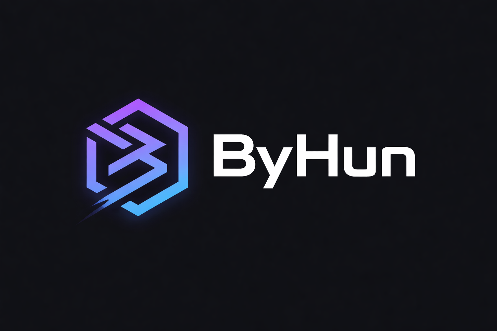

**ByHun** is a decentralized, open-source app store for secure, cross-platform web applications.

It allows users to discover, install, manage, and run applications built with web technologies (HTML, CSS, and JavaScript) in a unified and user-controlled environment, without relying on a centralized marketplace.

ByHun is designed to be flexible, transparent, and future-proof.

---

## ✨ Key Features

* 📦 **Decentralized App Store**
  Apps are distributed through independent sources such as GitHub or custom repositories, without a central authority.

* 🖥️📱 **Cross-Platform**
  Runs on **Windows** and **Android** from a single codebase, built with Flutter.

* 🌐 **Web-Based Apps**
  All apps are built using standard web technologies (HTML, CSS, JavaScript / LiveScript).

* 🗂️ **Library-Based Experience**
  Installed apps are organized in a clean, modern library interface, similar to a game launcher.

* 🔐 **Secure by Design**
  All user data and installed apps are handled locally with a strong focus on safety, integrity, and user control.

* 🧩 **Offline-First**
  Installed apps can run without an internet connection.

* 🧑‍💻 **Developer-Friendly**
  Open ecosystem designed to work seamlessly with **ByHunIDE**, the official IDE for building ByHun apps.

---

## 🧠 How ByHun Works (Concept Overview)

1. Users log in locally to access the app store.
2. Apps are added by providing:

   * App name
   * Developer name
   * App ID
   * Source (e.g. GitHub, MeanByte)
3. Apps are downloaded as `.byhun` packages.
4. Installed apps appear in the user’s library.
5. When launched, an app runs inside a secure WebView environment.
6. All data is stored locally and preserved across sessions.

ByHun does not rely on a centralized server or account system.

---

## 📦 App Package Format (`.byhun`)

* `.byhun` files are application packages containing web-based apps.
* Each package includes an `index.html` entry point.
* Packages follow a strict and validated internal structure.
* The format is designed for safety, portability, and long-term compatibility.

> Detailed specifications will be documented separately.

---

## 🧑‍💻 ByHunIDE (Companion Project)

**ByHunIDE** is the official IDE for creating ByHun applications.

It provides:

* Project templates
* App packaging tools
* Validation and build tooling

ByHunIDE lowers the barrier for developers and ensures consistency across the ecosystem.

---

## 🛠️ Tech Stack

* **Flutter / Dart** – Cross-platform native app
* **WebView** – App execution environment
* **HTML, CSS, JavaScript / LiveScript** – App development
* **Local-first architecture** – No mandatory backend

---

## 📌 Project Goals

* Decentralization by default
* User ownership of apps and data
* Open ecosystem for developers
* No lock-in, no mandatory store approval
* Clean, modern, and responsive UI
* Transparency and auditability

---

## 🚧 Project Status

ByHun is currently **under active development**.

Expect:

* Rapid iteration
* Breaking changes
* Evolving specifications

Contributions, ideas, and discussions are welcome.

---

## 🤝 Contributing

Contributions are encouraged!

You can help by:

* Reporting bugs
* Suggesting features
* Improving documentation
* Submitting pull requests

Please follow the project’s coding standards and keep changes well-documented.

---

## 📄 License

This project is licensed under the **Apache License 2.0**.
You are free to use, modify, and distribute this software under the terms of the license.

See the `LICENSE` file for more details.

---

## 🌍 Vision

ByHun aims to be more than just an app store.

It is an experiment in:

* decentralized software distribution
* web-based applications beyond the browser
* developer freedom
* user sovereignty

If you believe apps should be open, portable, and independent — **ByHun is for you**.
